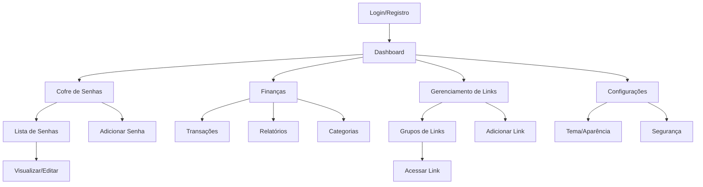

# Arca - Gerenciador de Vida Pessoal
## Documento de Requisitos do Produto (PRD)

## 1. Product Overview

O **Arca** é um gerenciador de vida pessoal completo que centraliza o controle de senhas, finanças e links organizados em uma interface minimalista e moderna. O aplicativo oferece uma solução integrada para usuários que buscam organizar aspectos essenciais de sua vida digital de forma segura e eficiente.

O produto resolve a fragmentação de ferramentas pessoais, oferecendo três módulos essenciais em uma única plataforma: cofre de senhas seguro, controle financeiro pessoal e gerenciamento inteligente de links por grupos, proporcionando uma experiência unificada e intuitiva.

## 2. Core Features

### 2.1 User Roles

| Role | Registration Method | Core Permissions |
|------|---------------------|------------------|
| Usuário | Registro por email + senha mestra | Acesso completo a todos os módulos, criação e gerenciamento de dados pessoais |

### 2.2 Feature Module

O aplicativo Arca consiste nas seguintes páginas principais:

1. **Dashboard**: visão geral dos módulos, estatísticas rápidas, acesso direto aos recursos mais utilizados.
2. **Cofre de Senhas**: listagem de credenciais, formulário de adição/edição, busca e categorização.
3. **Finanças**: controle de receitas e despesas, categorização, relatórios e metas financeiras.
4. **Gerenciamento de Links**: criação de grupos, organização de links por categoria, redirecionamento direto.
5. **Configurações**: preferências do usuário, configurações de segurança, personalização de tema.
6. **Login/Registro**: autenticação segura com senha mestra.

### 2.3 Page Details

| Page Name | Module Name | Feature description |
|-----------|-------------|---------------------|
| Dashboard | Visão Geral | Exibir resumo dos três módulos principais, estatísticas rápidas (total de senhas, saldo financeiro, grupos de links), acesso rápido às funcionalidades mais usadas |
| Dashboard | Navegação Rápida | Botões de acesso direto para adicionar nova senha, registrar transação financeira, criar novo link |
| Cofre de Senhas | Lista de Credenciais | Exibir todas as senhas salvas com busca por nome/site, filtros por categoria, visualização em cards com ícones |
| Cofre de Senhas | Gerenciamento de Senhas | Adicionar, editar e excluir credenciais, gerador de senhas seguras, categorização personalizada, criptografia local |
| Cofre de Senhas | Visualização Segura | Mostrar/ocultar senhas com autenticação, copiar para área de transferência, indicador de força da senha |
| Finanças | Controle de Transações | Registrar receitas e despesas, categorização automática e manual, anexar notas e tags |
| Finanças | Relatórios Financeiros | Gráficos de gastos por categoria, evolução mensal, metas de economia, saldo atual |
| Finanças | Categorias | Criar e gerenciar categorias personalizadas, definir orçamentos por categoria, alertas de limite |
| Gerenciamento de Links | Grupos de Links | Criar, editar e excluir grupos temáticos, organização visual por cards, contagem de links por grupo |
| Gerenciamento de Links | Links Organizados | Adicionar links com título e descrição, redirecionamento direto ao clicar, busca dentro dos grupos |
| Gerenciamento de Links | Navegação Inteligente | Abrir links em nova aba, histórico de acessos, links favoritos, importação de bookmarks |
| Configurações | Preferências Pessoais | Alternar entre modo claro/escuro, configurar senha mestra, backup e restauração de dados |
| Configurações | Segurança | Timeout de sessão, autenticação biométrica (se disponível), logs de acesso |
| Login/Registro | Autenticação | Login com email e senha mestra, registro de nova conta, recuperação de senha |
| Login/Registro | Segurança de Acesso | Validação de força da senha mestra, criptografia de dados, sessão segura |

## 3. Core Process

### Fluxo Principal do Usuário

O usuário acessa o aplicativo através da tela de login, onde insere suas credenciais ou cria uma nova conta. Após a autenticação, é direcionado ao Dashboard que oferece uma visão geral de todos os módulos.

No **Cofre de Senhas**, o usuário pode visualizar suas credenciais salvas, adicionar novas senhas usando o gerador integrado, e organizar por categorias. A busca permite encontrar rapidamente qualquer credencial.

No módulo **Finanças**, o usuário registra suas transações financeiras, categoriza gastos e receitas, e acompanha relatórios visuais de sua situação financeira. Pode definir metas e receber alertas de orçamento.

No **Gerenciamento de Links**, o usuário cria grupos temáticos e adiciona links organizados. Cada link pode ser acessado diretamente com um clique, mantendo a organização por categorias específicas.

## 4. User Interface Design

### 4.1 Design Style

- **Cores Primárias**: Verde Escuro Sóbrio (#1B4332) para elementos principais e navegação
- **Cores Secundárias**: Menta Claro (#A7F3D0) para destaques, botões de ação e elementos interativos
- **Cores de Apoio**: Cinza escuro (#374151) para textos, branco (#FFFFFF) para fundos no modo claro
- **Estilo de Botões**: Cantos arredondados (border-radius: 12px), efeitos de hover suaves, sombras sutis
- **Tipografia**: Poppins como fonte principal, tamanhos 14px para texto corrido, 16px para labels, 24px+ para títulos
- **Layout**: Design baseado em cards com espaçamento generoso, navegação por barra inferior fixa
- **Ícones**: Estilo minimalista com linha fina, preferencialmente Lucide ou Heroicons
- **Modo Escuro**: Fundo principal (#111827), cards em (#1F2937), textos em tons de cinza claro

### 4.2 Page Design Overview

| Page Name | Module Name | UI Elements |
|-----------|-------------|-------------|
| Dashboard | Visão Geral | Cards com cantos arredondados, ícones coloridos em verde menta, tipografia Poppins 18px para títulos, layout em grid responsivo |
| Dashboard | Estatísticas | Números grandes em Poppins Bold 32px, cores de destaque em menta, fundos com gradiente sutil |
| Cofre de Senhas | Lista | Cards brancos com sombra suave, ícones de sites, texto Poppins 14px, botões de ação em verde escuro |
| Cofre de Senhas | Formulários | Inputs com bordas arredondadas, labels em Poppins Medium 14px, botão principal em verde menta |
| Finanças | Gráficos | Cores em tons de verde, tipografia Poppins para legendas, cards com fundo branco/cinza escuro |
| Finanças | Transações | Lista com alternância de cores, ícones categorizados, valores em destaque com cores semânticas |
| Gerenciamento de Links | Grupos | Cards em grid, ícones personalizáveis, contadores em badges arredondados, hover effects suaves |
| Gerenciamento de Links | Links | Lista compacta, favicons dos sites, botões de redirecionamento em menta claro |
| Configurações | Controles | Switches modernos, sliders para ajustes, seções bem definidas com divisores sutis |
| Login/Registro | Formulários | Design centralizado, inputs com foco em verde menta, botões com gradiente sutil |

### 4.3 Responsiveness

O aplicativo é desenvolvido com abordagem mobile-first, garantindo experiência otimizada em dispositivos móveis e adaptação fluida para tablets e desktops. A navegação por barra inferior é otimizada para interação touch, com áreas de toque adequadas (mínimo 44px). O layout utiliza breakpoints responsivos e componentes que se adaptam automaticamente ao tamanho da tela, mantendo a legibilidade e usabilidade em todas as resoluções.