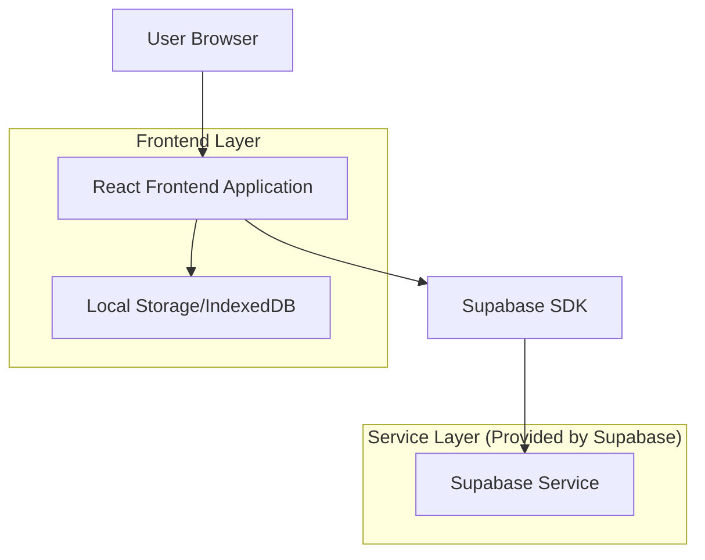
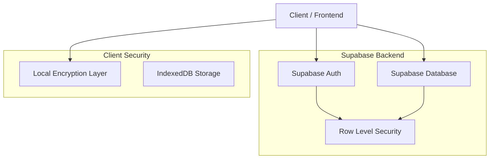
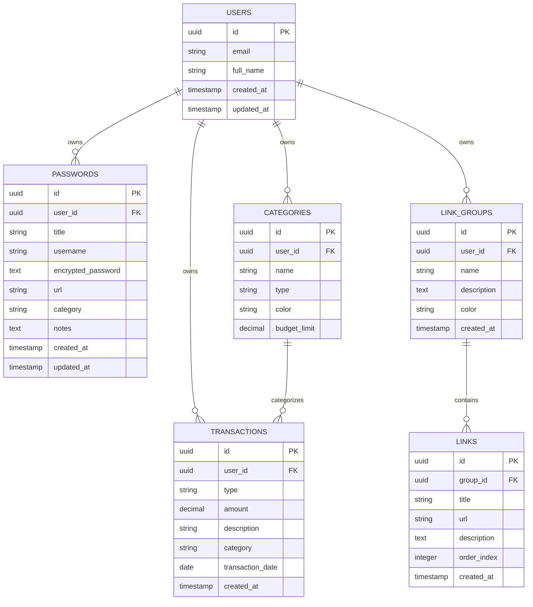

# Arca - Gerenciador de Vida Pessoal
## Documento de Arquitetura Técnica

## 1. Architecture design



## 2. Technology Description

- **Frontend**: React@18 + TypeScript + Tailwind CSS@3 + Vite + React Router
- **Backend**: Supabase (Authentication, Database, Storage)
- **State Management**: Zustand para gerenciamento de estado global
- **Criptografia**: crypto-js para criptografia local de senhas
- **UI Components**: Radix UI + Lucide React para ícones
- **Charts**: Recharts para gráficos financeiros

## 3. Route definitions

| Route | Purpose |
|-------|---------|
| / | Página inicial - redireciona para /dashboard se autenticado, senão para /login |
| /login | Página de login e registro de usuários |
| /dashboard | Dashboard principal com visão geral dos módulos |
| /passwords | Cofre de senhas - listagem e gerenciamento de credenciais |
| /passwords/add | Formulário para adicionar nova senha |
| /passwords/edit/:id | Formulário para editar senha existente |
| /finances | Módulo de finanças - visão geral e transações |
| /finances/add | Formulário para adicionar nova transação |
| /finances/reports | Relatórios e gráficos financeiros |
| /finances/categories | Gerenciamento de categorias financeiras |
| /links | Gerenciamento de links - visão de grupos |
| /links/group/:id | Visualização de links dentro de um grupo específico |
| /links/add | Formulário para adicionar novo link |
| /settings | Configurações do aplicativo e preferências do usuário |

## 4. API definitions

### 4.1 Core API

**Autenticação de Usuário**
```
POST /auth/v1/signup
POST /auth/v1/token
POST /auth/v1/logout
```

**Gerenciamento de Senhas**
```
GET /rest/v1/passwords
POST /rest/v1/passwords
PATCH /rest/v1/passwords?id=eq.{id}
DELETE /rest/v1/passwords?id=eq.{id}
```

Request (Adicionar Senha):
| Param Name | Param Type | isRequired | Description |
|------------|------------|------------|-------------|
| title | string | true | Nome/título da credencial |
| username | string | true | Nome de usuário ou email |
| password | string | true | Senha criptografada |
| url | string | false | URL do site/serviço |
| category | string | false | Categoria da senha |
| notes | string | false | Notas adicionais |

**Gerenciamento Financeiro**
```
GET /rest/v1/transactions
POST /rest/v1/transactions
PATCH /rest/v1/transactions?id=eq.{id}
DELETE /rest/v1/transactions?id=eq.{id}
```

Request (Adicionar Transação):
| Param Name | Param Type | isRequired | Description |
|------------|------------|------------|-------------|
| type | string | true | Tipo: 'income' ou 'expense' |
| amount | number | true | Valor da transação |
| description | string | true | Descrição da transação |
| category | string | true | Categoria da transação |
| date | string | true | Data da transação (ISO format) |

**Gerenciamento de Links**
```
GET /rest/v1/link_groups
POST /rest/v1/link_groups
GET /rest/v1/links
POST /rest/v1/links
```

Request (Adicionar Grupo de Links):
| Param Name | Param Type | isRequired | Description |
|------------|------------|------------|-------------|
| name | string | true | Nome do grupo |
| description | string | false | Descrição do grupo |
| color | string | false | Cor do grupo (hex) |

## 5. Server architecture diagram



## 6. Data model

### 6.1 Data model definition



### 6.2 Data Definition Language

**Tabela de Usuários (gerenciada pelo Supabase Auth)**
```sql
-- A tabela auth.users é gerenciada automaticamente pelo Supabase
-- Criamos uma tabela de perfil para dados adicionais
CREATE TABLE profiles (
    id UUID REFERENCES auth.users(id) PRIMARY KEY,
    full_name TEXT,
    avatar_url TEXT,
    created_at TIMESTAMP WITH TIME ZONE DEFAULT NOW(),
    updated_at TIMESTAMP WITH TIME ZONE DEFAULT NOW()
);

-- RLS Policy
ALTER TABLE profiles ENABLE ROW LEVEL SECURITY;
CREATE POLICY "Users can view own profile" ON profiles FOR SELECT USING (auth.uid() = id);
CREATE POLICY "Users can update own profile" ON profiles FOR UPDATE USING (auth.uid() = id);
```

**Tabela de Senhas**
```sql
CREATE TABLE passwords (
    id UUID PRIMARY KEY DEFAULT gen_random_uuid(),
    user_id UUID REFERENCES auth.users(id) ON DELETE CASCADE,
    title VARCHAR(255) NOT NULL,
    username VARCHAR(255) NOT NULL,
    encrypted_password TEXT NOT NULL,
    url VARCHAR(500),
    category VARCHAR(100),
    notes TEXT,
    created_at TIMESTAMP WITH TIME ZONE DEFAULT NOW(),
    updated_at TIMESTAMP WITH TIME ZONE DEFAULT NOW()
);

-- Índices
CREATE INDEX idx_passwords_user_id ON passwords(user_id);
CREATE INDEX idx_passwords_category ON passwords(category);

-- RLS Policies
ALTER TABLE passwords ENABLE ROW LEVEL SECURITY;
CREATE POLICY "Users can manage own passwords" ON passwords FOR ALL USING (auth.uid() = user_id);
```

**Tabela de Transações Financeiras**
```sql
CREATE TABLE transactions (
    id UUID PRIMARY KEY DEFAULT gen_random_uuid(),
    user_id UUID REFERENCES auth.users(id) ON DELETE CASCADE,
    type VARCHAR(20) NOT NULL CHECK (type IN ('income', 'expense')),
    amount DECIMAL(12,2) NOT NULL,
    description VARCHAR(255) NOT NULL,
    category VARCHAR(100) NOT NULL,
    transaction_date DATE NOT NULL,
    created_at TIMESTAMP WITH TIME ZONE DEFAULT NOW()
);

-- Índices
CREATE INDEX idx_transactions_user_id ON transactions(user_id);
CREATE INDEX idx_transactions_date ON transactions(transaction_date DESC);
CREATE INDEX idx_transactions_category ON transactions(category);

-- RLS Policies
ALTER TABLE transactions ENABLE ROW LEVEL SECURITY;
CREATE POLICY "Users can manage own transactions" ON transactions FOR ALL USING (auth.uid() = user_id);
```

**Tabela de Grupos de Links**
```sql
CREATE TABLE link_groups (
    id UUID PRIMARY KEY DEFAULT gen_random_uuid(),
    user_id UUID REFERENCES auth.users(id) ON DELETE CASCADE,
    name VARCHAR(255) NOT NULL,
    description TEXT,
    color VARCHAR(7) DEFAULT '#1B4332',
    created_at TIMESTAMP WITH TIME ZONE DEFAULT NOW()
);

-- Índices
CREATE INDEX idx_link_groups_user_id ON link_groups(user_id);

-- RLS Policies
ALTER TABLE link_groups ENABLE ROW LEVEL SECURITY;
CREATE POLICY "Users can manage own link groups" ON link_groups FOR ALL USING (auth.uid() = user_id);
```

**Tabela de Links**
```sql
CREATE TABLE links (
    id UUID PRIMARY KEY DEFAULT gen_random_uuid(),
    group_id UUID REFERENCES link_groups(id) ON DELETE CASCADE,
    title VARCHAR(255) NOT NULL,
    url VARCHAR(500) NOT NULL,
    description TEXT,
    order_index INTEGER DEFAULT 0,
    created_at TIMESTAMP WITH TIME ZONE DEFAULT NOW()
);

-- Índices
CREATE INDEX idx_links_group_id ON links(group_id);
CREATE INDEX idx_links_order ON links(order_index);

-- RLS Policies
ALTER TABLE links ENABLE ROW LEVEL SECURITY;
CREATE POLICY "Users can manage links in own groups" ON links FOR ALL 
USING (group_id IN (SELECT id FROM link_groups WHERE user_id = auth.uid()));
```

**Tabela de Categorias**
```sql
CREATE TABLE categories (
    id UUID PRIMARY KEY DEFAULT gen_random_uuid(),
    user_id UUID REFERENCES auth.users(id) ON DELETE CASCADE,
    name VARCHAR(100) NOT NULL,
    type VARCHAR(20) NOT NULL CHECK (type IN ('income', 'expense', 'both')),
    color VARCHAR(7) DEFAULT '#A7F3D0',
    budget_limit DECIMAL(12,2),
    created_at TIMESTAMP WITH TIME ZONE DEFAULT NOW()
);

-- Índices
CREATE INDEX idx_categories_user_id ON categories(user_id);
CREATE INDEX idx_categories_type ON categories(type);

-- RLS Policies
ALTER TABLE categories ENABLE ROW LEVEL SECURITY;
CREATE POLICY "Users can manage own categories" ON categories FOR ALL USING (auth.uid() = user_id);

-- Dados iniciais de categorias
INSERT INTO categories (user_id, name, type, color) VALUES
(auth.uid(), 'Alimentação', 'expense', '#EF4444'),
(auth.uid(), 'Transporte', 'expense', '#F97316'),
(auth.uid(), 'Moradia', 'expense', '#8B5CF6'),
(auth.uid(), 'Salário', 'income', '#10B981'),
(auth.uid(), 'Freelance', 'income', '#06B6D4');
```