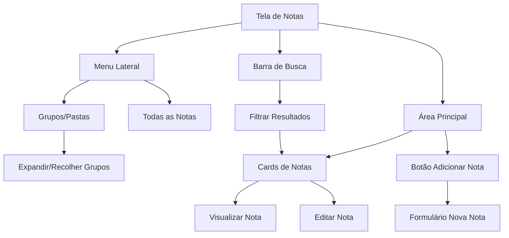

# Redesign da Tela de Notas - Requisitos de Produto

## 1. Visão Geral do Produto

Redesign completo da interface da tela de notas para criar uma experiência mais intuitiva e organizada, inspirada em gerenciadores de arquivos modernos com navegação lateral e área principal de conteúdo.

O novo design visa melhorar a usabilidade através de uma interface mais limpa, com navegação lateral recolhível e visualização de notas em cards simples, utilizando uma paleta de cores verde para criar uma identidade visual coesa e moderna.

## 2. Funcionalidades Principais

### 2.1 Papéis de Usuário

| Papel | Método de Registro | Permissões Principais |
|-------|-------------------|----------------------|
| Usuário Autenticado | Login existente no sistema | Pode criar, editar, excluir e organizar notas em grupos |

### 2.2 Módulo de Funcionalidades

O redesign da tela de notas consiste nas seguintes páginas principais:

1. **Tela Principal de Notas**: navegação lateral, área de conteúdo principal, barra de busca, botão de adicionar nota.

### 2.3 Detalhes das Páginas

| Nome da Página | Nome do Módulo | Descrição da Funcionalidade |
|----------------|----------------|----------------------------|
| Tela Principal de Notas | Navegação Lateral | Menu lateral recolhível com opção "Todas as notas" e lista de grupos/pastas organizados hierarquicamente. Permite expandir/recolher grupos e navegar entre eles. |
| Tela Principal de Notas | Área de Conteúdo Principal | Exibe notas como cards simples contendo apenas o título. Layout em grid responsivo que se adapta ao tamanho da tela. Cards com hover effects e indicadores visuais. |
| Tela Principal de Notas | Barra de Busca | Campo de busca no topo da área principal para filtrar notas por título ou conteúdo. Busca em tempo real com resultados instantâneos. |
| Tela Principal de Notas | Botão Adicionar Nota | Botão flutuante ou fixo proeminente para criar novas notas. Deve ser facilmente acessível e visualmente destacado. |
| Tela Principal de Notas | Sistema de Filtros | Filtros para mostrar apenas notas importantes, por data de criação, ou por grupo específico. |

## 3. Processo Principal

### Fluxo Principal do Usuário

1. **Acesso à Tela**: Usuário navega para a seção de notas
2. **Navegação por Grupos**: Utiliza o menu lateral para selecionar "Todas as notas" ou um grupo específico
3. **Visualização de Notas**: Visualiza as notas como cards simples na área principal
4. **Busca e Filtros**: Utiliza a barra de busca para encontrar notas específicas
5. **Criação de Nota**: Clica no botão "Adicionar Nova Nota" para criar uma nova nota
6. **Edição de Nota**: Clica em um card de nota para visualizar/editar o conteúdo

## 4. Design da Interface do Usuário

### 4.1 Estilo de Design

**Paleta de Cores:**
- **Verde Primário**: #10B981 (emerald-500) - Botões principais e elementos de destaque
- **Verde Secundário**: #059669 (emerald-600) - Estados hover e elementos ativos
- **Verde Claro**: #D1FAE5 (emerald-100) - Backgrounds sutis e elementos selecionados
- **Verde Escuro**: #064E3B (emerald-900) - Textos em modo escuro
- **Cinza Neutro**: #6B7280 (gray-500) - Textos secundários
- **Branco/Cinza Claro**: #F9FAFB (gray-50) - Backgrounds principais

**Estilo dos Botões:**
- Botões arredondados (border-radius: 12px)
- Botão principal com gradiente verde sutil
- Estados hover com transições suaves (300ms)
- Sombras sutis para profundidade

**Tipografia:**
- Fonte principal: Poppins (já utilizada no sistema)
- Títulos: 18px-24px, peso 600
- Textos principais: 14px-16px, peso 400
- Textos secundários: 12px-14px, peso 400

**Estilo de Layout:**
- Design baseado em cards com cantos arredondados
- Navegação lateral fixa com largura responsiva
- Grid responsivo para cards de notas
- Espaçamentos consistentes (múltiplos de 8px)
- Ícones da biblioteca Lucide React

### 4.2 Visão Geral do Design das Páginas

| Nome da Página | Nome do Módulo | Elementos da UI |
|----------------|----------------|-----------------|
| Tela Principal de Notas | Navegação Lateral | **Estilo**: Sidebar fixa com fundo verde claro (#F0FDF4), largura 280px (desktop), recolhível para 60px. **Layout**: Lista vertical com ícones e textos, separadores sutis entre seções. **Cores**: Verde primário para item ativo, cinza para inativos. **Animações**: Transições suaves ao expandir/recolher. |
| Tela Principal de Notas | Área de Conteúdo | **Estilo**: Grid responsivo (3-4 colunas desktop, 2 colunas tablet, 1 coluna mobile). **Layout**: Cards com altura fixa (120px), padding interno 16px, sombra sutil. **Cores**: Fundo branco, borda verde clara ao hover. **Tipografia**: Título da nota em 16px peso 500, truncado com ellipsis. |
| Tela Principal de Notas | Barra de Busca | **Estilo**: Campo de input com ícone de lupa, largura total, altura 48px. **Layout**: Posicionado no topo da área principal, margin-bottom 24px. **Cores**: Fundo branco, borda cinza, foco com borda verde. **Animações**: Transição suave no foco, ícone com cor verde. |
| Tela Principal de Notas | Botão Adicionar | **Estilo**: Botão flutuante circular (56px) ou retangular no header. **Layout**: Posição fixa bottom-right ou integrado no header. **Cores**: Gradiente verde (#10B981 para #059669), texto branco. **Animações**: Hover com escala 1.05, sombra expandida. |

### 4.3 Responsividade

**Desktop First com Adaptação Mobile:**
- **Desktop (>1024px)**: Sidebar fixa visível, grid de 3-4 colunas para cards
- **Tablet (768px-1024px)**: Sidebar recolhível, grid de 2 colunas
- **Mobile (<768px)**: Sidebar como overlay/drawer, grid de 1 coluna, botão hamburger para navegação

**Otimizações Touch:**
- Áreas de toque mínimas de 44px
- Gestos de swipe para navegação mobile
- Feedback visual imediato em toques
- Botões com espaçamento adequado para dedos

**Funcionalidades Responsivas:**
- Menu lateral se transforma em drawer mobile
- Cards se adaptam ao tamanho da tela
- Barra de busca mantém funcionalidade em todos os tamanhos
- Botão adicionar se posiciona adequadamente em cada breakpoint