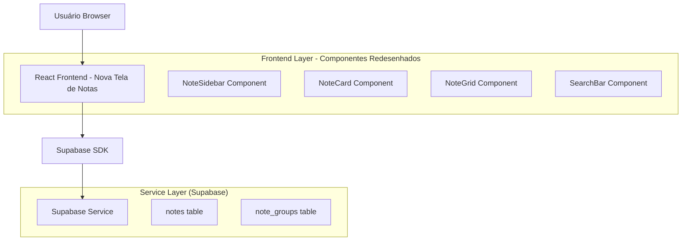
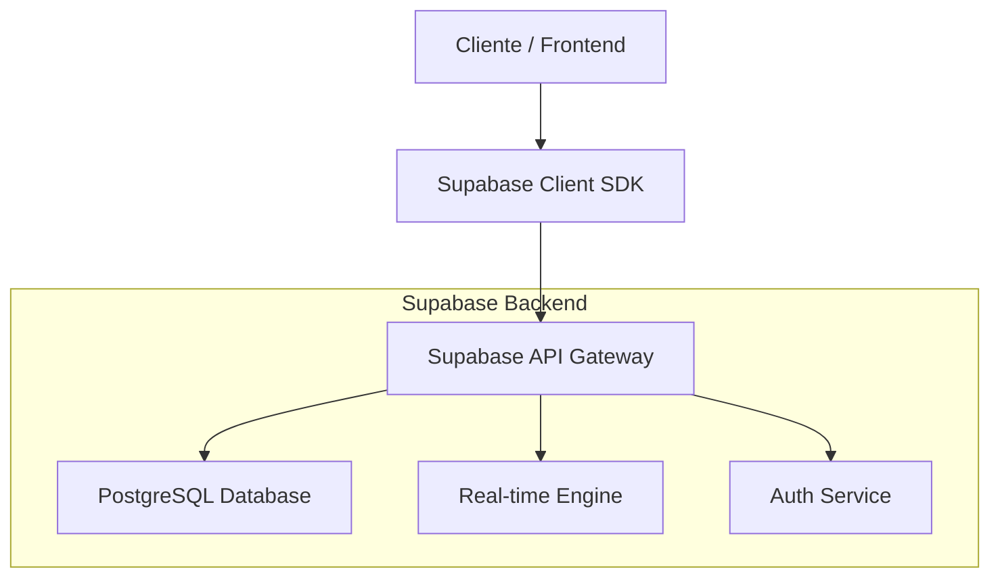
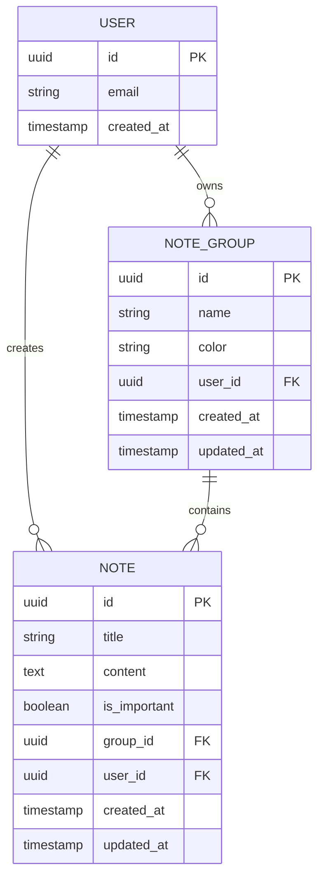

# Arquitetura Técnica - Redesign da Tela de Notas

## 1. Design da Arquitetura



## 2. Descrição da Tecnologia

- **Frontend**: React@18 + TypeScript + TailwindCSS@3 + Vite
- **Backend**: Supabase (PostgreSQL + Auth + Real-time)
- **Gerenciamento de Estado**: Zustand (notesStore existente)
- **Ícones**: Lucide React
- **Animações**: TailwindCSS transitions + Framer Motion (opcional)

## 3. Definições de Rotas

| Rota | Propósito |
|------|-----------|
| /notes | Tela principal de notas redesenhada com sidebar e grid de cards |
| /notes?group={id} | Filtrar notas por grupo específico via URL |
| /notes?search={term} | Busca de notas via URL |

## 4. Definições de API

### 4.1 APIs Principais

**Busca de notas com filtros**
```
GET /rest/v1/notes
```

Parâmetros de Query:
| Nome do Parâmetro | Tipo | Obrigatório | Descrição |
|-------------------|------|-------------|-----------|
| group_id | string | false | ID do grupo para filtrar |
| search | string | false | Termo de busca no título/conteúdo |
| is_important | boolean | false | Filtrar apenas notas importantes |

Resposta:
| Nome do Parâmetro | Tipo | Descrição |
|-------------------|------|-----------|
| id | string | ID único da nota |
| title | string | Título da nota |
| content | string | Conteúdo da nota |
| is_important | boolean | Se a nota é marcada como importante |
| group_id | string | ID do grupo da nota |
| created_at | string | Data de criação |

**Busca de grupos de notas**
```
GET /rest/v1/note_groups
```

Resposta:
| Nome do Parâmetro | Tipo | Descrição |
|-------------------|------|-----------|
| id | string | ID único do grupo |
| name | string | Nome do grupo |
| color | string | Cor do grupo |
| user_id | string | ID do usuário proprietário |

## 5. Arquitetura do Servidor



## 6. Modelo de Dados

### 6.1 Definição do Modelo de Dados



### 6.2 Linguagem de Definição de Dados

**Tabela de Grupos de Notas (note_groups)**
```sql
-- Tabela já existe, sem alterações necessárias
CREATE TABLE note_groups (
    id UUID PRIMARY KEY DEFAULT gen_random_uuid(),
    name VARCHAR(255) NOT NULL,
    color VARCHAR(50) DEFAULT 'blue',
    user_id UUID REFERENCES auth.users(id) ON DELETE CASCADE,
    created_at TIMESTAMP WITH TIME ZONE DEFAULT NOW(),
    updated_at TIMESTAMP WITH TIME ZONE DEFAULT NOW()
);

-- Índices existentes
CREATE INDEX idx_note_groups_user_id ON note_groups(user_id);
```

**Tabela de Notas (notes)**
```sql
-- Tabela já existe, sem alterações necessárias
CREATE TABLE notes (
    id UUID PRIMARY KEY DEFAULT gen_random_uuid(),
    title VARCHAR(500) NOT NULL,
    content TEXT,
    is_important BOOLEAN DEFAULT FALSE,
    group_id UUID REFERENCES note_groups(id) ON DELETE CASCADE,
    user_id UUID REFERENCES auth.users(id) ON DELETE CASCADE,
    created_at TIMESTAMP WITH TIME ZONE DEFAULT NOW(),
    updated_at TIMESTAMP WITH TIME ZONE DEFAULT NOW()
);

-- Índices existentes
CREATE INDEX idx_notes_user_id ON notes(user_id);
CREATE INDEX idx_notes_group_id ON notes(group_id);
CREATE INDEX idx_notes_is_important ON notes(is_important);
CREATE INDEX idx_notes_created_at ON notes(created_at DESC);

-- Índice adicional para busca de texto
CREATE INDEX idx_notes_search ON notes USING gin(to_tsvector('portuguese', title || ' ' || content));
```

**Políticas RLS (já existentes)**
```sql
-- Políticas para note_groups
ALTER TABLE note_groups ENABLE ROW LEVEL SECURITY;
CREATE POLICY "Users can view own note groups" ON note_groups FOR SELECT USING (auth.uid() = user_id);
CREATE POLICY "Users can insert own note groups" ON note_groups FOR INSERT WITH CHECK (auth.uid() = user_id);
CREATE POLICY "Users can update own note groups" ON note_groups FOR UPDATE USING (auth.uid() = user_id);
CREATE POLICY "Users can delete own note groups" ON note_groups FOR DELETE USING (auth.uid() = user_id);

-- Políticas para notes
ALTER TABLE notes ENABLE ROW LEVEL SECURITY;
CREATE POLICY "Users can view own notes" ON notes FOR SELECT USING (auth.uid() = user_id);
CREATE POLICY "Users can insert own notes" ON notes FOR INSERT WITH CHECK (auth.uid() = user_id);
CREATE POLICY "Users can update own notes" ON notes FOR UPDATE USING (auth.uid() = user_id);
CREATE POLICY "Users can delete own notes" ON notes FOR DELETE USING (auth.uid() = user_id);
```

**Componentes React a serem criados/modificados:**

1. **NotesPageRedesigned.tsx** - Nova página principal
2. **NoteSidebar.tsx** - Componente da navegação lateral
3. **NoteCard.tsx** - Card simples para exibir nota
4. **NoteGrid.tsx** - Grid responsivo de cards
5. **SearchBar.tsx** - Barra de busca otimizada
6. **AddNoteButton.tsx** - Botão flutuante/fixo para adicionar

**Modificações no Store:**
- Adicionar função de busca otimizada
- Implementar filtros por grupo via URL
- Adicionar estado para sidebar (expandida/recolhida)
- Otimizar queries para o novo layout