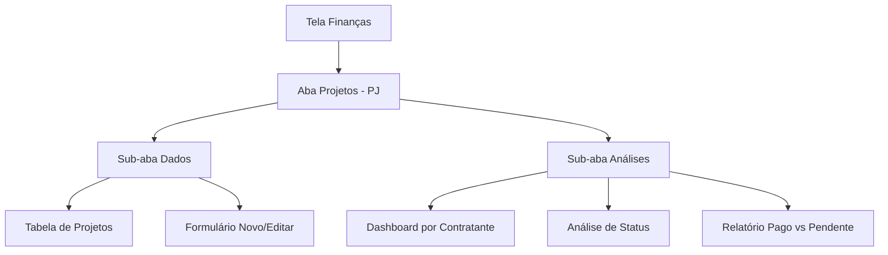

# Projetos - PJ - Documento de Requisitos

## 1. Visão Geral do Produto

Nova funcionalidade "Projetos - PJ" integrada à tela de Finanças do sistema Arca, permitindo o gerenciamento completo de projetos de pessoa jurídica com controle financeiro detalhado.

- Soluciona a necessidade de controlar projetos PJ de forma organizada com análises financeiras integradas
- Destinado a usuários que gerenciam múltiplos projetos e contratos empresariais
- Oferece visibilidade completa do portfólio de projetos com análises de rentabilidade e status de pagamentos

## 2. Funcionalidades Principais

### 2.1 Papéis de Usuário

| Papel | Método de Registro | Permissões Principais |
|-------|-------------------|----------------------|
| Usuário Autenticado | Login existente no sistema | Pode visualizar, criar, editar e excluir projetos PJ |

### 2.2 Módulo de Funcionalidades

Nossa funcionalidade Projetos - PJ consiste nas seguintes páginas principais:
1. **Aba Projetos - PJ**: navegação integrada à tela de Finanças, tabela de dados, formulários de entrada
2. **Sub-aba Dados**: interface de tabela para CRUD de projetos
3. **Sub-aba Análises**: dashboards e relatórios dos dados cadastrados

### 2.3 Detalhes das Páginas

| Nome da Página | Nome do Módulo | Descrição da Funcionalidade |
|----------------|----------------|----------------------------|
| Aba Projetos - PJ | Navegação Principal | Integração como nova aba na tela de Finanças existente |
| Sub-aba Dados | Tabela de Projetos | Exibir tabela com colunas: CIDADE, PROJETO, CONTRATANTE, LOTES, Shape, VALOR, STATUS, PAGO, PENDENTE, OBS. Incluir botões para adicionar, editar e excluir registros |
| Sub-aba Dados | Formulário de Projeto | Criar/editar projetos com validação de campos obrigatórios e formatação de valores monetários |
| Sub-aba Análises | Dashboard Financeiro | Mostrar total por CONTRATANTE, análise de STATUS (Iniciado, Finalizado, etc.), comparativo PAGO vs PENDENTE |
| Sub-aba Análises | Relatórios por Cidade | Agrupar projetos por CIDADE com totais e médias de valores |
| Sub-aba Análises | Análise de Lotes | Estatísticas sobre quantidade de lotes por projeto e valores médios |

## 3. Processo Principal

**Fluxo do Usuário Autenticado:**

1. Usuário acessa a tela de Finanças
2. Clica na nova aba "Projetos - PJ"
3. Por padrão, visualiza a sub-aba "Dados" com a tabela de projetos
4. Pode adicionar novo projeto clicando em "Novo Projeto"
5. Preenche formulário com todos os campos da estrutura
6. Salva e retorna à tabela atualizada
7. Pode alternar para sub-aba "Análises" para visualizar relatórios
8. Visualiza dashboards com totais por contratante, status e análises financeiras

## 4. Design da Interface do Usuário

### 4.1 Estilo de Design

- **Cores primárias**: Emerald (#10B981) para elementos principais, seguindo padrão do sistema
- **Cores secundárias**: Cinza (#6B7280) para textos secundários, vermelho (#EF4444) para valores pendentes, verde (#10B981) para valores pagos
- **Estilo de botões**: Arredondados (rounded-xl) com efeitos hover
- **Fontes**: Sistema padrão com tamanhos text-sm para tabelas, text-lg para títulos
- **Layout**: Design baseado em cards com bordas suaves, navegação por tabs
- **Ícones**: Lucide React icons para consistência (Building2, PieChart, Plus, Edit, Trash2)

### 4.2 Visão Geral do Design das Páginas

| Nome da Página | Nome do Módulo | Elementos da UI |
|----------------|----------------|-----------------|
| Aba Projetos - PJ | Navegação | Tab button integrado ao sistema existente com ícone Building2, cores emerald quando ativo |
| Sub-aba Dados | Tabela Principal | Tabela responsiva com colunas fixas, botão "Novo Projeto" no canto superior direito, ações de editar/excluir por linha |
| Sub-aba Dados | Formulário Modal | Modal overlay com campos organizados em grid 2 colunas, validação visual, botões Salvar/Cancelar |
| Sub-aba Análises | Cards de Estatísticas | Grid de cards com ícones, valores destacados em verde/vermelho, gráficos simples usando Recharts |
| Sub-aba Análises | Tabelas de Resumo | Tabelas agrupadas por contratante/cidade com totais em negrito, ordenação por valor |

### 4.3 Responsividade

- **Desktop-first** com adaptação para mobile
- **Tabela responsiva** com scroll horizontal em telas menores
- **Modal adaptativo** que ocupa tela inteira em mobile
- **Cards de análise** empilhados verticalmente em mobile
- **Navegação por tabs** mantém funcionalidade touch-friendly