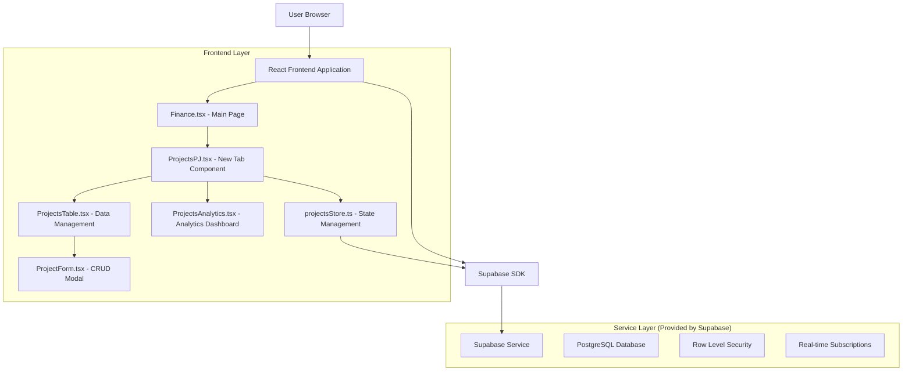
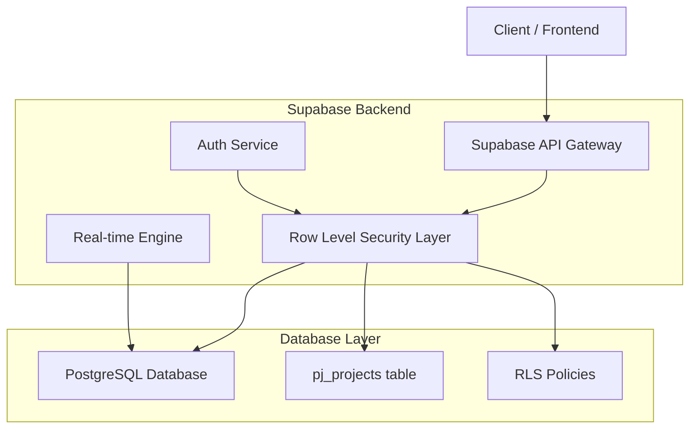
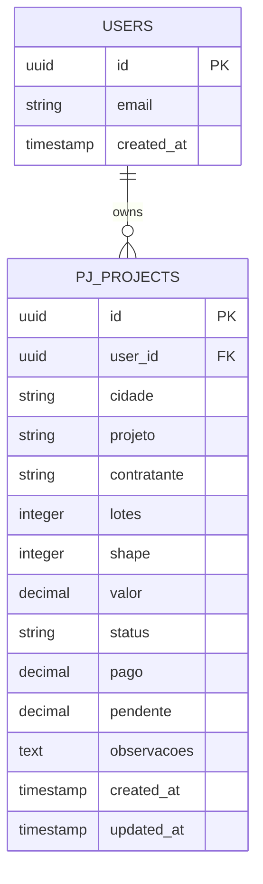

# Projetos - PJ - Arquitetura Técnica

## 1. Design da Arquitetura



## 2. Descrição da Tecnologia

- Frontend: React@18 + TypeScript + Tailwind CSS@3 + Vite
- Backend: Supabase (PostgreSQL + Auth + Real-time)
- State Management: Zustand (seguindo padrão existente)
- Charts: Recharts (já utilizado no projeto)
- Icons: Lucide React (padrão do projeto)

## 3. Definições de Rotas

| Rota | Propósito |
|------|-----------|
| /finance | Página principal de Finanças com nova aba "Projetos - PJ" integrada |

## 4. Definições de API

### 4.1 API Principal

**Operações CRUD para Projetos PJ**

```
GET /rest/v1/pj_projects
```

Request: Parâmetros de filtro via query string
| Nome do Parâmetro | Tipo | Obrigatório | Descrição |
|-------------------|------|-------------|-----------|
| user_id | UUID | true | ID do usuário autenticado |
| status | string | false | Filtro por status do projeto |
| contratante | string | false | Filtro por contratante |

Response:
| Nome do Parâmetro | Tipo | Descrição |
|-------------------|------|-----------|
| id | UUID | ID único do projeto |
| cidade | string | Cidade do projeto |
| projeto | string | Nome do projeto |
| contratante | string | Nome do contratante |
| lotes | integer | Quantidade de lotes |
| shape | integer | Valor shape |
| valor | decimal | Valor total do projeto |
| status | string | Status atual (INICIADO, FINALIZADO, etc.) |
| pago | decimal | Valor já pago |
| pendente | decimal | Valor pendente |
| observacoes | text | Observações do projeto |
| created_at | timestamp | Data de criação |
| updated_at | timestamp | Data de atualização |

Exemplo Response:
```json
[
  {
    "id": "123e4567-e89b-12d3-a456-426614174000",
    "cidade": "São Raimundo Nonato",
    "projeto": "Bela Vista (1)",
    "contratante": "FAGNER",
    "lotes": 1500,
    "shape": 12,
    "valor": 18000.00,
    "status": "INICIADO",
    "pago": 13736.32,
    "pendente": 4263.68,
    "observacoes": "Falta pagamento do Ely",
    "created_at": "2024-01-15T10:30:00Z",
    "updated_at": "2024-01-15T10:30:00Z"
  }
]
```

```
POST /rest/v1/pj_projects
```

Request:
| Nome do Parâmetro | Tipo | Obrigatório | Descrição |
|-------------------|------|-------------|-----------|
| cidade | string | true | Cidade do projeto |
| projeto | string | true | Nome do projeto |
| contratante | string | true | Nome do contratante |
| lotes | integer | true | Quantidade de lotes |
| shape | integer | false | Valor shape |
| valor | decimal | true | Valor total do projeto |
| status | string | true | Status inicial |
| pago | decimal | false | Valor já pago (default: 0) |
| observacoes | text | false | Observações |

```
PUT /rest/v1/pj_projects?id=eq.{project_id}
```

Request: Mesmos campos do POST para atualização

```
DELETE /rest/v1/pj_projects?id=eq.{project_id}
```

### 4.2 API de Análises

```
GET /rest/v1/rpc/get_projects_analytics
```

Response:
| Nome do Parâmetro | Tipo | Descrição |
|-------------------|------|-----------|
| total_projects | integer | Total de projetos |
| total_value | decimal | Valor total de todos os projetos |
| total_paid | decimal | Total já pago |
| total_pending | decimal | Total pendente |
| by_contractor | array | Agrupamento por contratante |
| by_status | array | Agrupamento por status |
| by_city | array | Agrupamento por cidade |

## 5. Diagrama da Arquitetura do Servidor



## 6. Modelo de Dados

### 6.1 Definição do Modelo de Dados



### 6.2 Linguagem de Definição de Dados

**Tabela de Projetos PJ (pj_projects)**

```sql
-- Criar tabela
CREATE TABLE pj_projects (
    id UUID PRIMARY KEY DEFAULT gen_random_uuid(),
    user_id UUID REFERENCES auth.users(id) ON DELETE CASCADE,
    cidade VARCHAR(100) NOT NULL,
    projeto VARCHAR(200) NOT NULL,
    contratante VARCHAR(100) NOT NULL,
    lotes INTEGER NOT NULL DEFAULT 0,
    shape INTEGER DEFAULT 0,
    valor DECIMAL(15,2) NOT NULL DEFAULT 0,
    status VARCHAR(50) NOT NULL DEFAULT 'INICIADO',
    pago DECIMAL(15,2) DEFAULT 0,
    pendente DECIMAL(15,2) DEFAULT 0,
    observacoes TEXT,
    created_at TIMESTAMP WITH TIME ZONE DEFAULT NOW(),
    updated_at TIMESTAMP WITH TIME ZONE DEFAULT NOW()
);

-- Criar índices
CREATE INDEX idx_pj_projects_user_id ON pj_projects(user_id);
CREATE INDEX idx_pj_projects_contratante ON pj_projects(contratante);
CREATE INDEX idx_pj_projects_status ON pj_projects(status);
CREATE INDEX idx_pj_projects_cidade ON pj_projects(cidade);

-- Trigger para atualizar updated_at
CREATE OR REPLACE FUNCTION update_updated_at_column()
RETURNS TRIGGER AS $$
BEGIN
    NEW.updated_at = NOW();
    RETURN NEW;
END;
$$ language 'plpgsql';

CREATE TRIGGER update_pj_projects_updated_at 
    BEFORE UPDATE ON pj_projects 
    FOR EACH ROW 
    EXECUTE FUNCTION update_updated_at_column();

-- Trigger para calcular pendente automaticamente
CREATE OR REPLACE FUNCTION calculate_pendente()
RETURNS TRIGGER AS $$
BEGIN
    NEW.pendente = NEW.valor - COALESCE(NEW.pago, 0);
    RETURN NEW;
END;
$$ language 'plpgsql';

CREATE TRIGGER calculate_pj_projects_pendente
    BEFORE INSERT OR UPDATE ON pj_projects
    FOR EACH ROW
    EXECUTE FUNCTION calculate_pendente();

-- Políticas RLS
ALTER TABLE pj_projects ENABLE ROW LEVEL SECURITY;

-- Política para usuários autenticados verem apenas seus próprios projetos
CREATE POLICY "Users can view own projects" ON pj_projects
    FOR SELECT USING (auth.uid() = user_id);

CREATE POLICY "Users can insert own projects" ON pj_projects
    FOR INSERT WITH CHECK (auth.uid() = user_id);

CREATE POLICY "Users can update own projects" ON pj_projects
    FOR UPDATE USING (auth.uid() = user_id);

CREATE POLICY "Users can delete own projects" ON pj_projects
    FOR DELETE USING (auth.uid() = user_id);

-- Função para análises
CREATE OR REPLACE FUNCTION get_projects_analytics(p_user_id UUID)
RETURNS JSON AS $$
DECLARE
    result JSON;
BEGIN
    SELECT json_build_object(
        'total_projects', COUNT(*),
        'total_value', COALESCE(SUM(valor), 0),
        'total_paid', COALESCE(SUM(pago), 0),
        'total_pending', COALESCE(SUM(pendente), 0),
        'by_contractor', (
            SELECT json_agg(
                json_build_object(
                    'contratante', contratante,
                    'total_projects', COUNT(*),
                    'total_value', SUM(valor),
                    'total_paid', SUM(pago),
                    'total_pending', SUM(pendente)
                )
            )
            FROM pj_projects 
            WHERE user_id = p_user_id 
            GROUP BY contratante
        ),
        'by_status', (
            SELECT json_agg(
                json_build_object(
                    'status', status,
                    'count', COUNT(*),
                    'total_value', SUM(valor)
                )
            )
            FROM pj_projects 
            WHERE user_id = p_user_id 
            GROUP BY status
        ),
        'by_city', (
            SELECT json_agg(
                json_build_object(
                    'cidade', cidade,
                    'count', COUNT(*),
                    'total_value', SUM(valor)
                )
            )
            FROM pj_projects 
            WHERE user_id = p_user_id 
            GROUP BY cidade
        )
    ) INTO result
    FROM pj_projects 
    WHERE user_id = p_user_id;
    
    RETURN result;
END;
$$ LANGUAGE plpgsql SECURITY DEFINER;

-- Dados iniciais de exemplo
INSERT INTO pj_projects (user_id, cidade, projeto, contratante, lotes, shape, valor, status, pago, observacoes)
VALUES 
    (auth.uid(), 'São Raimundo Nonato', 'Bela Vista (1)', 'FAGNER', 1500, 12, 18000.00, 'INICIADO', 13736.32, 'Falta pagamento do Ely'),
    (auth.uid(), 'Lagoa do Barro', 'Município', 'DR. THIAGO', 300, 40, 12000.00, 'FINALIZADO', 5000.00, ''),
    (auth.uid(), 'Campo Maior', 'Agenor Melo', 'ESTADO', 51, 12, 3612.00, 'INICIADO', 0, '');
```